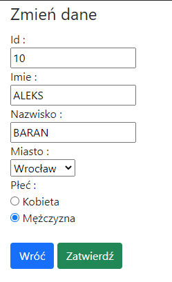

# PHP_Crud
Autor : Maksymilian Jachymczak
PHP BASIC CRUD APP
----
### ZAŁOŻENIA :
- użytkownik wyświetla listę klientów.
- może usunąć klienta
- może modyfikować dane klienta
- może dodać nowego klienta do bazy
- na stronie może wyświetlać sie max 10 elementów

----
### TECHNOLOGIE :
- php7
- mysql
- bootstrap 5
- html 5

----
### INSTALACJA :
1. Uruchom Xampp
2. Włącz serwer Apache i MySQL
3. Stwórz bazę danych 'crud_maksymilian_jachymczak'
4. Zaimportuj tabelę z danymi z pliku `crud_maksymilian_jachymczak.sql` na serwer
5. Pobierz folder Crud i wstaw do folderu `xampp/htdocs/`
6. W przeglądarce wpisz `127.0.0.1/Crud/`

### INSTRUKCJA :
- Na stronie głównej `index.php` możemy skorzystać z wszelkich funkcjonalności, usunąć klienta klikając 'Usuń', Dodać klienta klikając 'Dodaj klienta' oraz modyfikować dane klikając 'Aktualizuj'.

- Dodawanie klienta zabezpieczone walidacją html5, imie i nazwisko automatycznie zamieniane na wielkie litery
  
- Aktualizacja danych pobiera dane klienta oraz umożliwia zmianę id  \

